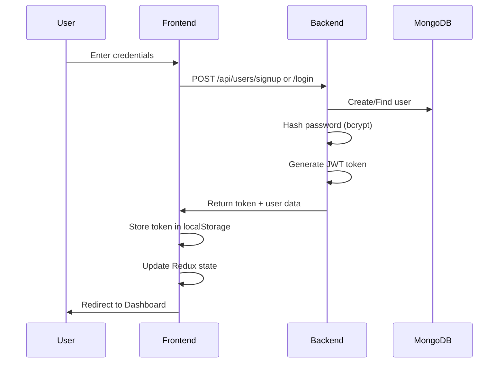
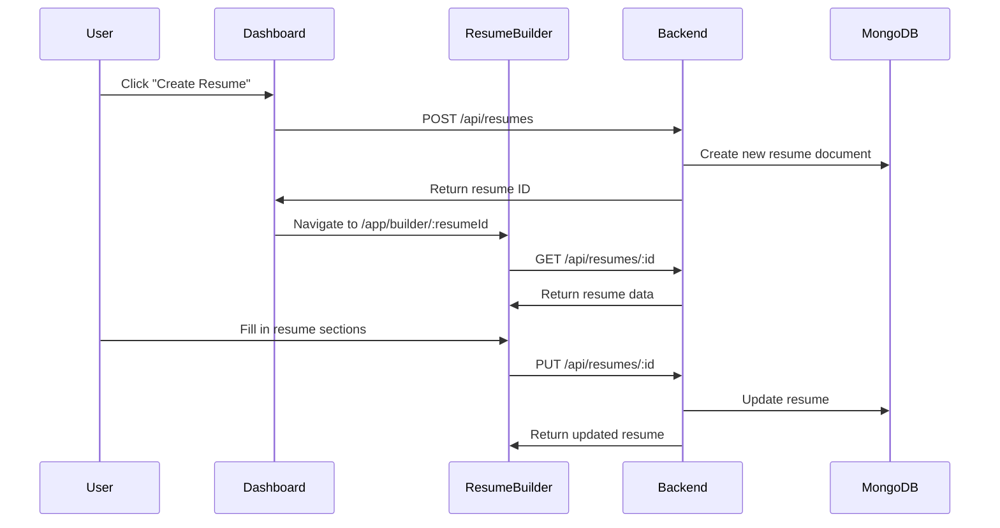
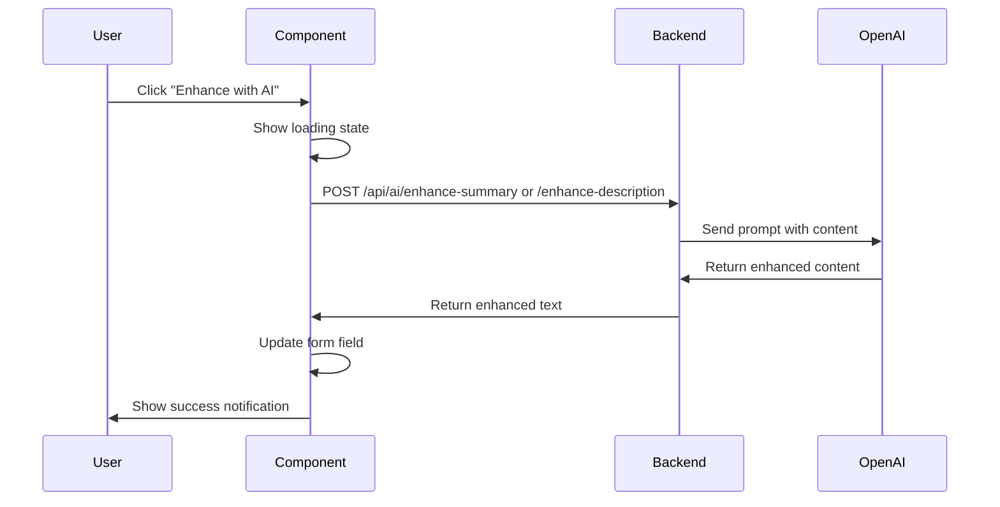
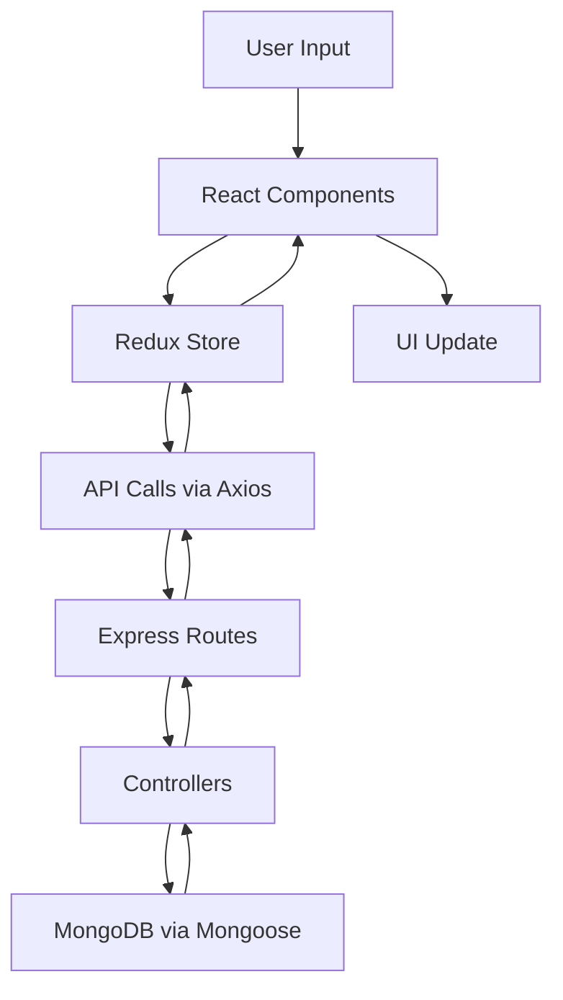
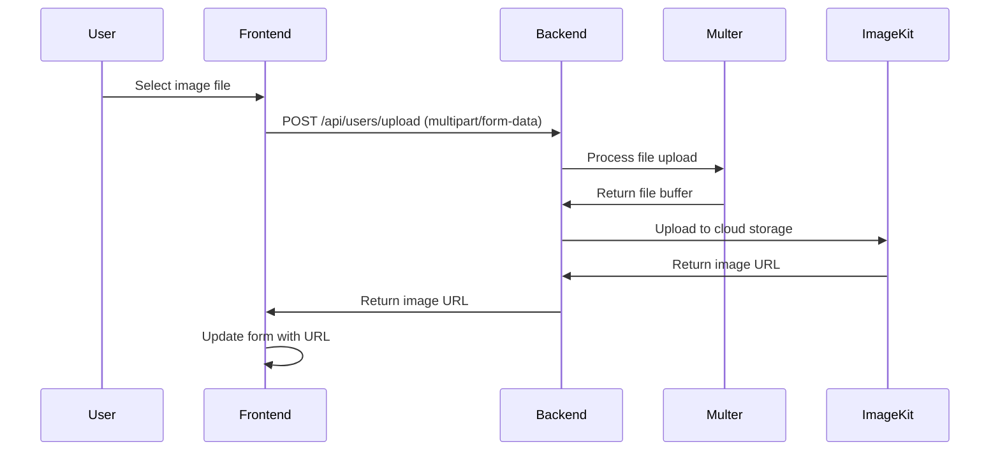

# Vitai - AI-Powered Resume Builder

A modern, full-stack resume builder application with AI-powered content enhancement capabilities. Built with React, Node.js, Express, and MongoDB.

## 📋 Table of Contents

- [Overview](#overview)
- [Features](#features)
- [Tech Stack](#tech-stack)
- [Project Structure](#project-structure)
- [Getting Started](#getting-started)
- [How It Works](#how-it-works)
- [API Endpoints](#api-endpoints)
- [Environment Variables](#environment-variables)
- [Development Workflow](#development-workflow)

## 🎯 Overview

Vitai is a comprehensive resume builder that helps users create professional resumes with multiple templates and AI-powered content suggestions. The application provides an intuitive interface for managing personal information, work experience, education, skills, and projects.

## ✨ Features

### Core Features

- **User Authentication**: Secure signup/login with JWT tokens and bcrypt password hashing
- **Resume Management**: Create, edit, delete, and manage multiple resumes
- **Multiple Templates**: Choose from various professional resume templates (Classic, Modern, Minimal, etc.)
- **Real-time Preview**: Live preview of resume as you build it
- **AI-Powered Enhancement**:
  - Professional summary generation and improvement
  - Job description enhancement
  - Content suggestions powered by OpenAI
- **Image Upload**: Profile picture upload with ImageKit integration
- **PDF Resume Upload**: Parse existing resumes to auto-fill information
- **Color Customization**: Personalize resume accent colors
- **Public/Private Resumes**: Control resume visibility

### Resume Sections

- Personal Information (name, contact, social links)
- Professional Summary
- Work Experience
- Education
- Skills
- Projects

## 🛠 Tech Stack

### Frontend

- **React 19** - UI library
- **Redux Toolkit** - State management
- **React Router** - Navigation
- **Vite** - Build tool and dev server
- **TailwindCSS 4** - Styling
- **Axios** - HTTP client
- **Lucide React** - Icons
- **React Hot Toast** - Notifications

### Backend

- **Node.js** - Runtime environment
- **Express 5** - Web framework
- **MongoDB** - Database
- **Mongoose** - ODM for MongoDB
- **JWT** - Authentication
- **Bcrypt** - Password hashing
- **OpenAI API** - AI content generation
- **ImageKit** - Image storage and optimization
- **Multer** - File upload handling
- **CORS** - Cross-origin resource sharing

## 📁 Project Structure

```
Vitai/
├── client/                    # Frontend application
│   ├── public/               # Static assets
│   ├── src/
│   │   ├── app/             # Redux store and slices
│   │   │   └── features/    # Redux feature slices (authSlice, etc.)
│   │   ├── assets/          # Images, fonts, etc.
│   │   ├── components/      # Reusable React components
│   │   │   ├── ColorPicker.jsx
│   │   │   ├── EducationForm.jsx
│   │   │   ├── ExperienceForm.jsx
│   │   │   ├── PersonalInfoForm.jsx
│   │   │   ├── ProfessionalSummary.jsx
│   │   │   ├── ProjectForm.jsx
│   │   │   ├── SkillForm.jsx
│   │   │   ├── TemplateSelector.jsx
│   │   │   ├── ResumePreview.jsx
│   │   │   └── home/        # Home page components
│   │   ├── configs/         # API configuration
│   │   ├── pages/           # Page components
│   │   │   ├── Home.jsx
│   │   │   ├── Login.jsx
│   │   │   ├── Dashboard.jsx
│   │   │   ├── ResumeBuilder.jsx
│   │   │   ├── Preview.jsx
│   │   │   └── Layout.jsx
│   │   ├── App.jsx          # Main app component
│   │   └── main.jsx         # Entry point
│   ├── index.html
│   ├── vite.config.js
│   └── package.json
│
└── server/                   # Backend application
    ├── configs/             # Configuration files
    │   ├── db.js           # MongoDB connection
    │   ├── ai.js           # OpenAI configuration
    │   ├── imageKit.js     # ImageKit configuration
    │   └── multer.js       # File upload configuration
    ├── controllers/         # Request handlers
    │   ├── userController.js
    │   ├── resumeController.js
    │   └── aiController.js
    ├── models/             # Database schemas
    │   ├── User.js
    │   └── Resume.js
    ├── routes/             # API routes
    │   ├── userRoutes.js
    │   ├── resumeRoutes.js
    │   └── aiRoutes.js
    ├── middlewares/        # Custom middleware
    ├── server.js          # Entry point
    └── package.json
```

## 🚀 Getting Started

### Prerequisites

- Node.js (v16 or higher)
- MongoDB (local or Atlas)
- OpenAI API key
- ImageKit account

### Installation

1. **Clone the repository**

```bash
git clone <repository-url>
cd Vitai
```

2. **Install dependencies**

```bash
# Install server dependencies
cd server
npm install

# Install client dependencies
cd ../client
npm install
```

3. **Set up environment variables**

Create `.env` file in the `server` directory:

```env
PORT=3000
MONGODB_URI=mongodb://localhost:27017/vitai
JWT_SECRET=your_jwt_secret_key
OPENAI_API_KEY=your_openai_api_key
OPENAI_BASE_URL=https://api.openai.com/v1
IMAGEKIT_PUBLIC_KEY=your_imagekit_public_key
IMAGEKIT_PRIVATE_KEY=your_imagekit_private_key
IMAGEKIT_URL_ENDPOINT=your_imagekit_url_endpoint
```

Create `.env` file in the `client` directory:

```env
VITE_API_URL=http://localhost:3000
```

4. **Start the development servers**

```bash
# Terminal 1 - Start backend server
cd server
npm run server

# Terminal 2 - Start frontend dev server
cd client
npm run dev
```

The application will be available at:

- Frontend: `http://localhost:5173`
- Backend: `http://localhost:3000`

## 🔄 How It Works

### 1. User Authentication Flow



**Key Components:**

- `Login.jsx` - Login/Signup UI
- `userController.js` - Authentication logic
- `authSlice.js` - Redux state management
- `User.js` - MongoDB user schema

### 2. Resume Creation & Management Flow



**Key Components:**

- `Dashboard.jsx` - Resume list and management
- `ResumeBuilder.jsx` - Multi-step resume builder
- `resumeController.js` - CRUD operations
- `Resume.js` - MongoDB resume schema

### 3. Resume Builder Steps

The resume builder follows a step-by-step process:

1. **Personal Information** (`PersonalInfoForm.jsx`)

   - Name, profession, contact details
   - Social links (LinkedIn, GitHub, website)
   - Profile picture upload via ImageKit

2. **Professional Summary** (`ProfessionalSummary.jsx`)

   - Manual entry or AI-generated summary
   - AI enhancement feature using OpenAI

3. **Work Experience** (`ExperienceForm.jsx`)

   - Company, position, dates
   - Job description with AI enhancement option
   - Current position toggle

4. **Education** (`EducationForm.jsx`)

   - Institution, degree, field of study
   - Graduation date and GPA

5. **Skills** (`SkillForm.jsx`)

   - Add/remove skills
   - Tag-based interface

6. **Projects** (`ProjectForm.jsx`)

   - Project name, type, description
   - Project links

7. **Template & Color** (`TemplateSelector.jsx`, `ColorPicker.jsx`)
   - Choose resume template
   - Customize accent color

### 4. AI Enhancement Flow



**Key Components:**

- `aiController.js` - AI request handling
- `ProfessionalSummary.jsx` - Summary enhancement
- `ExperienceForm.jsx` - Job description enhancement
- OpenAI GPT-4 model for content generation

### 5. Data Flow Architecture



### 6. State Management

The application uses Redux Toolkit for state management:

- **authSlice**: User authentication state
  - `user` - Current user data
  - `token` - JWT token
  - `isAuthenticated` - Auth status
  - `loading` - Loading state

**Actions:**

- `login()` - Set user and token
- `logout()` - Clear auth state
- `setLoading()` - Update loading state

### 7. File Upload Process



**Key Components:**

- `multer.js` - File upload middleware
- `imageKit.js` - ImageKit configuration
- `userController.js` - Upload handler

## 🔌 API Endpoints

### User Routes (`/api/users`)

| Method | Endpoint  | Description             | Auth Required |
| ------ | --------- | ----------------------- | ------------- |
| POST   | `/signup` | Create new user account | No            |
| POST   | `/login`  | Login user              | No            |
| GET    | `/data`   | Get current user data   | Yes           |
| POST   | `/upload` | Upload profile image    | Yes           |

### Resume Routes (`/api/resumes`)

| Method | Endpoint | Description          | Auth Required |
| ------ | -------- | -------------------- | ------------- |
| POST   | `/`      | Create new resume    | Yes           |
| GET    | `/`      | Get all user resumes | Yes           |
| GET    | `/:id`   | Get specific resume  | Yes           |
| PUT    | `/:id`   | Update resume        | Yes           |
| DELETE | `/:id`   | Delete resume        | Yes           |

### AI Routes (`/api/ai`)

| Method | Endpoint               | Description                  | Auth Required |
| ------ | ---------------------- | ---------------------------- | ------------- |
| POST   | `/enhance-summary`     | Enhance professional summary | Yes           |
| POST   | `/enhance-description` | Enhance job description      | Yes           |

## 🔐 Environment Variables

### Server (.env)

```env
# Server Configuration
PORT=3000

# Database
MONGODB_URI=mongodb://localhost:27017/vitai

# Authentication
JWT_SECRET=your_secret_key_here

# OpenAI Configuration
OPENAI_API_KEY=sk-...
OPENAI_BASE_URL=https://api.openai.com/v1

# ImageKit Configuration
IMAGEKIT_PUBLIC_KEY=public_...
IMAGEKIT_PRIVATE_KEY=private_...
IMAGEKIT_URL_ENDPOINT=https://ik.imagekit.io/your_id
```

### Client (.env)

```env
# API Base URL
VITE_API_URL=http://localhost:3000
```

## 💻 Development Workflow

### Adding a New Resume Section

1. **Create the form component** in `client/src/components/`
2. **Update Resume schema** in `server/models/Resume.js`
3. **Add to ResumeBuilder** in `client/src/pages/ResumeBuilder.jsx`
4. **Update preview template** to display the new section

### Adding a New Template

1. **Create template component** in `client/src/components/templates/`
2. **Add to TemplateSelector** in `client/src/components/TemplateSelector.jsx`
3. **Update Resume schema** default template options

### Testing the Application

```bash
# Run backend tests
cd server
npm test

# Run frontend tests
cd client
npm test

# Build for production
cd client
npm run build
```

### Deployment Checklist

- [ ] Set production environment variables
- [ ] Update CORS settings in `server.js`
- [ ] Build frontend: `npm run build`
- [ ] Set up MongoDB Atlas for production database
- [ ] Configure ImageKit for production
- [ ] Set up OpenAI API rate limits
- [ ] Deploy backend to hosting service (Heroku, Railway, etc.)
- [ ] Deploy frontend to hosting service (Vercel, Netlify, etc.)

## 🐛 Common Issues & Solutions

### MongoDB Connection Error

- Ensure MongoDB is running: `mongod`
- Check MONGODB_URI in `.env`
- Verify network connectivity

### AI Enhancement Not Working

- Verify OPENAI_API_KEY is correct
- Check OpenAI API quota and billing
- Ensure OPENAI_BASE_URL is set correctly

### Image Upload Failing

- Verify ImageKit credentials
- Check file size limits in multer configuration
- Ensure proper CORS settings

### Authentication Issues

- Clear localStorage and try logging in again
- Verify JWT_SECRET matches between sessions
- Check token expiration settings

## 📝 Database Schema

### User Schema

```javascript
{
  name: String (required),
  email: String (required, unique),
  password: String (required, hashed),
  timestamps: true
}
```

### Resume Schema

```javascript
{
  userId: ObjectId (ref: User),
  title: String,
  public: Boolean,
  template: String,
  accent_color: String,
  professional_summary: String,
  skills: [String],
  personal_info: {
    image, full_name, profession, email, phone,
    location, linkedin, github, website
  },
  experience: [{
    company, position, start_date, end_date,
    description, is_current
  }],
  project: [{
    name, type, description, link
  }],
  education: [{
    institution, degree, field, graduation_date, gpa
  }],
  timestamps: true
}
```

## 🤝 Contributing

1. Fork the repository
2. Create a feature branch: `git checkout -b feature-name`
3. Commit changes: `git commit -am 'Add feature'`
4. Push to branch: `git push origin feature-name`
5. Submit a pull request

## 📄 License

This project is licensed under the ISC License.

## 👨‍💻 Author

Shanmukha Pranav

---

**Built with ❤️ using React, Node.js, and AI**
